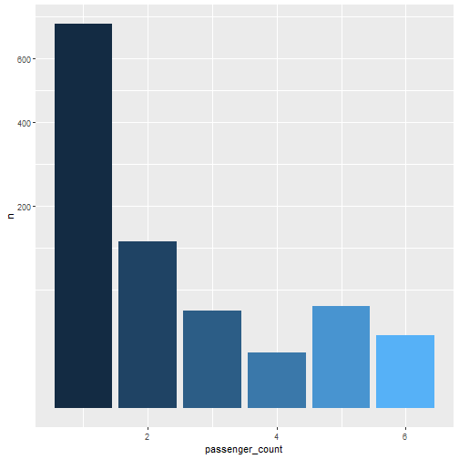
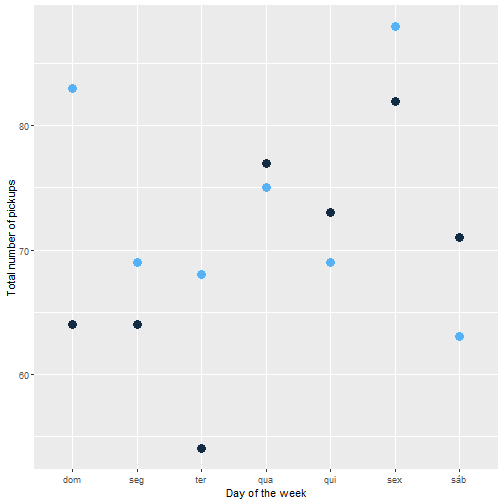
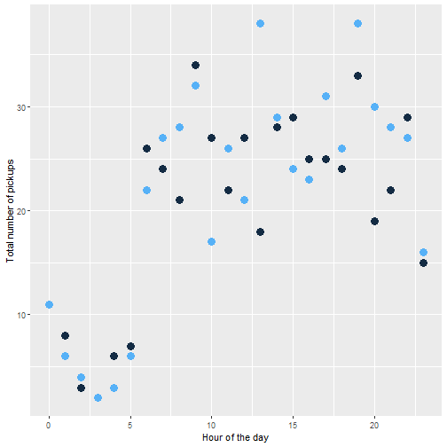

```r
library(dplyr)
library(leaflet)
library(lubridate)
library(plotly)
library(ggplot2)
```


```r
df_redq_coord = read.csv('./data_source/redq_coord.csv')

leaflet(data = df_redq_coord) %>% 
  addProviderTiles("Esri.NatGeoWorldMap") %>%
  addCircleMarkers(~longitude, ~latitude, radius = 1, color = "blue", fillOpacity = 0.3)
```

```
## Error in loadNamespace(name): there is no package called 'webshot'
```


```r
df_1 = read.csv('./data_source/facilities-v1.csv')
df_1 %>% 
  filter(city=='New York') -> df_1_ny
distinct_df = df_1_ny %>% count(facsubgrp)
```


## Pontos de metro de Ny


```r
df_2 = read.csv('./data_source/NYC_Transit_Subway_Entrance_And_Exit_Data.csv')
```


```r
filter(df_redq_coord, point=='pp1') -> pp1
filter(df_redq_coord, point=='pp2') -> pp2
filter(df_redq_coord, point=='pp3') -> pp3
filter(df_redq_coord, point=='pp4') -> pp4

train %>%
  filter(pickup_latitude>=df_redq_coord$latitude[[1]][[1]]) %>% 
  filter(pickup_latitude<=df_redq_coord$latitude[[2]][[1]]) %>% 
  filter(pickup_longitude>=df_redq_coord$longitude[[1]][[1]]) %>% 
  filter(pickup_longitude<=df_redq_coord$longitude[[3]][[1]])-> df_pickup_dentroquadr

train %>%
  filter(dropoff_latitude>=df_redq_coord$latitude[[1]][[1]]) %>% 
  filter(dropoff_latitude<=df_redq_coord$latitude[[2]][[1]]) %>% 
  filter(dropoff_longitude>=df_redq_coord$longitude[[1]][[1]]) %>% 
  filter(dropoff_longitude<=df_redq_coord$longitude[[3]][[1]])-> df_dropoff_dentroquadr

df_1_ny %>%
  filter(latitude>=df_redq_coord$latitude[[1]][[1]]) %>% 
  filter(latitude<=df_redq_coord$latitude[[2]][[1]]) %>% 
  filter(longitude>=df_redq_coord$longitude[[1]][[1]]) %>% 
  filter(longitude<=df_redq_coord$longitude[[3]][[1]])-> df_ny_dentroquadr

df_2 %>%
  filter(Station.Latitude>=df_redq_coord$latitude[[1]][[1]]) %>% 
  filter(Station.Latitude<=df_redq_coord$latitude[[2]][[1]]) %>% 
  filter(Station.Longitude>=df_redq_coord$longitude[[1]][[1]]) %>% 
  filter(Station.Longitude<=df_redq_coord$longitude[[3]][[1]])-> df_nysubway_dentroquadr
```

## Mapa das corridas que começaram no quadrante


```r
set.seed(22)
# Criando uma sequencia de 1 ate a quantidade de total de linhas
linhas.idx <- seq_len(nrow(df_pickup_dentroquadr))
# Obtendo aleatoriamente 10000 amostras de linhas do dataset
linhas.sample <- sample(linhas.idx, 1000)
# Amostra aleatoria com 10000 dados
df_pickup_dentroquadr[linhas.sample, ] -> df_pickup_dentroquadr_sample 

leaflet(data = df_pickup_dentroquadr_sample) %>% 
  addProviderTiles("Esri.NatGeoWorldMap") %>%
  addCircleMarkers(~ pickup_longitude, ~pickup_latitude, radius = 1, color = "blue", fillOpacity = 0.3)
```

```
## Error in loadNamespace(name): there is no package called 'webshot'
```


## Mapa das corridas
### O pontos azuis são o inicio da corrida (pickup), os pontos vermelhos são as chegadas (dropoff) e os verde são pontos de interesse. 


```r
df_ny_dentroquadr %>% 
  dplyr::select('city','facname','facgroup')

df_nysubway_dentroquadr %>% 
  dplyr::select('Station.Name','Station.Latitude','Station.Longitude')
```


## Plot no mapa com os pontos de pickup e dropoff. Também com pins de pontos de interesse dos aquivos de estações de metro de ny e facilities


```r
set.seed(22)
# Criando uma sequencia de 1 ate a quantidade de total de linhas
linhas.idx <- seq_len(nrow(df_dropoff_dentroquadr))
# Obtendo aleatoriamente 10000 amostras de linhas do dataset
linhas.sample <- sample(linhas.idx, 1000)
# Amostra aleatoria com 10000 dados
df_dropoff_dentroquadr[linhas.sample, ] -> df_dropoff_dentroquadr_sample 

leaflet(data = df_dropoff_dentroquadr_sample) %>% 
  addProviderTiles("Esri.NatGeoWorldMap") %>%
  addCircleMarkers(~ dropoff_longitude, ~dropoff_latitude, radius = 1, color = "red", fillOpacity = 0.3) %>% 
  addCircleMarkers(df_pickup_dentroquadr_sample$pickup_longitude, df_pickup_dentroquadr_sample$pickup_latitude, radius = 1, color = "blue", fillOpacity = 0.3) %>% 
  addMarkers(df_ny_dentroquadr$longitude, df_ny_dentroquadr$latitude,popup=df_ny_dentroquadr$facname) %>% 
  addMarkers(df_nysubway_dentroquadr$Station.Longitude, df_nysubway_dentroquadr$Station.Latitude,popup=df_nysubway_dentroquadr$Station.Name)
```

```
## Error in loadNamespace(name): there is no package called 'webshot'
```


### Analises Básicas sobre minidaset
## As viagens que pegam os passageiros (pickoff, azul no grafico) tem uma concentração maior na entrada da Penn Station, pois provavelmente as pessoas estão pegando taxi vindo do transporte público.


```r
# df_pickup_dentroquadr_sample %>%
#   plot_ly(x=~trip_duration,type="histogram")
# 
# df_dropoff_dentroquadr_sample %>%
#   plot_ly(x=~trip_duration,type="histogram") %>%
#   layout(barmode = "overlay",xaxis=list(range=c(0,5000)))

plot_ly(alpha = 0.5) %>%
  add_histogram(x = df_pickup_dentroquadr_sample$trip_duration) %>%
  add_histogram(x = df_dropoff_dentroquadr_sample$trip_duration) %>%
  layout(barmode = "overlay",xaxis=list(range=c(0,5000)))
```

```
## Error in loadNamespace(name): there is no package called 'webshot'
```

```r
#sd(df_pickup_dentroquadr_sample$trip_duration)
#sd(df_dropoff_dentroquadr_sample$trip_duration)
```


```r
p1 <- df_pickup_dentroquadr_sample %>%
  group_by(passenger_count) %>%
  count() %>%
  ggplot(aes(passenger_count, n, fill = passenger_count)) +
  geom_col() +
  scale_y_sqrt() +
  theme(legend.position = "none")

plot(p1)
```



```r
p4 <- df_pickup_dentroquadr_sample %>%
  mutate(wday = wday(pickup_datetime, label = TRUE)) %>%
  group_by(wday, vendor_id) %>%
  count() %>%
  ggplot(aes(wday, n, colour = vendor_id)) +
  geom_point(size = 4) +
  labs(x = "Day of the week", y = "Total number of pickups") +
  theme(legend.position = "none")

plot(p4)
```



```r
p5 <- df_pickup_dentroquadr_sample %>%
  mutate(hpick = hour(pickup_datetime)) %>%
  group_by(hpick, vendor_id) %>%
  count() %>%
  ggplot(aes(hpick, n, color = vendor_id)) +
  geom_point(size = 4) +
  labs(x = "Hour of the day", y = "Total number of pickups") +
  theme(legend.position = "none")

plot(p5)
```




# Preparação dos dados


```r
source('preprocessing.R')

## Adiciona distância Euclidiana calculada a partir das coordenadas (arquivo Preprocessing.R)
#Distancia em KM
df_pickup_dentroquadr_sample$dist_euclidiana = dist_eucl(df_pickup_dentroquadr_sample)

## Adiciona distância de Manhattan calculada a partir das coordenadas (arquivo Preprocessing.R)
df_pickup_dentroquadr_sample$dist_manhattan = dist_manh(df_pickup_dentroquadr_sample)
df_pickup_dentroquadr_sample$velocidade = df_pickup_dentroquadr_sample$dist_manhattan / df_pickup_dentroquadr_sample$trip_duration

## Prepara data e hora da paprtida
### Com isso é possível pegar horário de pico e dia da semana
df_pickup_dentroquadr_sample$pickup_hour <- hour(df_pickup_dentroquadr_sample$pickup_datetime)
df_pickup_dentroquadr_sample$pickup_month <- month(df_pickup_dentroquadr_sample$pickup_datetime)
df_pickup_dentroquadr_sample$pickup_weekdays <- wday(df_pickup_dentroquadr_sample$pickup_datetime)
```


## Regração linear


```r
linearMod <- lm(dropoff_latitude ~ dropoff_longitude, data=df_dropoff_dentroquadr_sample) 
print(linearMod)
```

```
## 
## Call:
## lm(formula = dropoff_latitude ~ dropoff_longitude, data = df_dropoff_dentroquadr_sample)
## 
## Coefficients:
##       (Intercept)  dropoff_longitude  
##          42.89290            0.02896
```

```r
linearMod <- lm(pickup_latitude ~ pickup_longitude, data=df_pickup_dentroquadr_sample) 
print(linearMod)
```

```
## 
## Call:
## lm(formula = pickup_latitude ~ pickup_longitude, data = df_pickup_dentroquadr_sample)
## 
## Coefficients:
##      (Intercept)  pickup_longitude  
##          20.2273           -0.2774
```


## R2 da regração linear, o do pickup com maior valor, mais 'próximo' da reta. 


```r
dropoff.lm = lm(dropoff_latitude ~ dropoff_longitude, data=df_dropoff_dentroquadr_sample)
summary(dropoff.lm)$r.squared
```

```
## [1] 0.001276659
```

```r
pickup.lm = lm(pickup_latitude ~ pickup_longitude, data=df_pickup_dentroquadr_sample)
summary(pickup.lm)$r.squared
```

```
## [1] 0.1779617
```


