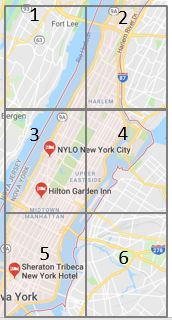

```{r}
library(magrittr) # quando der problema com o "%>%"
library('dplyr') # selecao e filtro de dados
library('geosphere') # localizacao geoespacial
library(lubridate) # datas, fun??es hour, month, wday
library(plotly) # plot dos gr?ficos
library(knitr) # usada pelo plotly
library(dummies) # cria colunas bin?rias para vari?veis categ?ricas
library(scales) # normaliza dados rescalando para float de 0 a 1
library(randomForest) # cria rede neural para criar regress?o de tempo de viagem
source('preprocessing.R')
source('mapa_calor_ny.R')
```


```{r}
train <- read.csv("data_source/train.csv")

# pega apenas as 10 primeiras linhas para teste
df <- head(train, 10000)
```

# Prepara??o dos dados

## Regi?o de sa?da
```{r}
df$bairro_saida = mapply(define_bairro, df$pickup_longitude, df$pickup_latitude)
df$bairro_chegada = mapply(define_bairro, df$dropoff_longitude, df$dropoff_latitude)

```

## Adiciona dist?ncia Euclidiana calculada a partir das coordenadas (arquivo Preprocessing.R)
```{r}

df$dist_euclidiana = dist_eucl(df)

```

<<<<<<< HEAD
## Adiciona dist?ncia de Manhattan calculada a partir das coordenadas (arquivo Preprocessing.R)
=======


## Adiciona distância de Manhattan calculada a partir das coordenadas (arquivo Preprocessing.R)
>>>>>>> b55202b5a477884bb84b53677033b358de63060c
```{r}

df$dist_manhattan = dist_manh(df)
df$velocidade = df$dist_manhattan / df$trip_duration
```

## Prepara data e hora da paprtida (acho que n?o precisa da chegada)
## Com isso ? poss?vel pegar hor?rio de pico e dia da semana

```{r}
df$pickup_hour <- hour(df$pickup_datetime)
df$pickup_month <- month(df$pickup_datetime)
df$pickup_weekdays <- wday(df$pickup_datetime)
```

## Limpeza de corridas zeradas e limpa corridas muito longas
```{r}
df %>%
  filter(df$dist_manhattan > 0.5) -> df
df %>%
  filter(df$trip_duration < 10000) -> df
```

# An?lises descritivas

## Divis?o das regi?es que separamos em NY:



## Quantidade de viagens por regi?o de sa?da e chegada
```{r}
df %>%
  group_by(bairro_saida) %>%
  count() -> data_plot
plot1 = plot_ly(data= data_plot, x= ~bairro_saida, y= ~n, type = 'bar')

df %>%
  group_by(bairro_chegada) %>%
  count() -> data_plot
plot2 = plot_ly(data= data_plot, x= ~bairro_chegada, y= ~n, type = 'bar')

subplot(plot1, plot2, shareY = T)
```
## M?dia da velocidade das viagens por regi?o de sa?da e chegada
```{r}
df %>%
  group_by(bairro_saida) %>%
  summarize(velocidade_media = mean(velocidade),n()) -> data_plot
plot1 = plot_ly(data= data_plot, x= ~bairro_saida, y= ~velocidade_media, type = 'bar')

df %>%
  group_by(bairro_chegada) %>%
  summarize(velocidade_media = mean(velocidade),n()) -> data_plot
plot2 = plot_ly(data= data_plot, x= ~bairro_chegada, y= ~velocidade_media, type = 'bar')

subplot(plot1, plot2, shareY = T)
```


## Plotar correla??o passageiros tempo
```{r}
p1 = plot_ly(data= df, x= ~passenger_count, y= ~trip_duration, type = 'scatter', mode = 'markers') 
p2 = plot_ly(data= df, x= ~dist_manhattan, y= ~trip_duration, type = 'scatter', mode = 'markers') %>% 
<<<<<<< HEAD
  layout(title="Correla??o Num. Passageiros vs. Tempo   |   Correla??o Dist?ncia vs. Tempo")
=======
  layout(title="Correlacao Num. Passageiros vs. Tempo   |   Correlacao Distancia vs. Tempo")
>>>>>>> b55202b5a477884bb84b53677033b358de63060c
subplot(p1, p2)
```

## M?dia da velocidade das viagens por hora e dia da semana
```{r}
df %>%
  group_by(pickup_hour) %>%
  summarize(velocidade_media = mean(velocidade),n()) -> data_plot1
plot1 = plot_ly(data= data_plot1, x= ~pickup_hour, y= ~velocidade_media, type = 'scatter', mode='lines')
df %>%
  group_by(pickup_weekdays) %>%
  summarize(velocidade_media = mean(velocidade),n()) -> data_plot2
plot2 = plot_ly(data= data_plot2, x= ~pickup_weekdays, y= ~velocidade_media, type = 'scatter', mode='lines') %>% 
  layout(title="Horas       |        Dias da Semana") 

subplot(plot1, plot2, shareY = T)
```

## Quantidade de viagens por hora e dia da semana
```{r}
df %>%
  group_by(pickup_hour) %>%
  count() -> data_plot1
plot1 = plot_ly(data= data_plot1, x= ~pickup_hour, y= ~n, type = 'bar')
df %>%
  group_by(pickup_weekdays) %>%
  count() -> data_plot2
plot2 = plot_ly(data= data_plot2, x= ~pickup_weekdays, y= ~n, type = 'bar') %>% 
  layout(title="Horas       |        Dias da Semana") 

subplot(plot1, plot2)
```

## Plota mapa de calor de New York com ponto de partida da viagem
```{r message=FALSE, warning=FALSE}
heat_map_taxi(train, "pickup")
```

## Plota mapa de calor de New York com ponto de chegada da viagem
```{r message=FALSE, warning=FALSE}
heat_map_taxi(train, "dropoff")
```

# Normalizar dados para o modelo

## Primeiro, criando vari?veis dummies para dia da semana e hora
```{r}
week_dummy = dummy(df$pickup_weekdays, sep='_')
hour_dummy = dummy(df$pickup_hour, sep='_')
bairro_dummy = dummy(df$bairro_chegada, sep='_')

df = data.frame(cbind(df, week_dummy, hour_dummy, bairro_dummy))
```

## Agora normalizando com Min Max Scaler as vari?veis: dist?ncia, trip_duration e passenger_count
```{r}
df$dist_manhattan = rescale(df$dist_manhattan)
df$trip_duration = rescale(df$trip_duration)
df$passenger_count = rescale(df$trip_duration)

```

## define X (train features) e y (target) para o treino
```{r}
X <- df[c('passenger_count', 'dist_manhattan', 'pickup_weekdays_1', 'pickup_weekdays_2', 'pickup_weekdays_3',
         'pickup_weekdays_4', 'pickup_weekdays_5', 'pickup_weekdays_6', 'pickup_weekdays_7', 'pickup_hour_1',
         'pickup_hour_2', 'pickup_hour_3', 'pickup_hour_4', 'pickup_hour_5', 'pickup_hour_6', 'pickup_hour_7',
         'pickup_hour_8', 'pickup_hour_9', 'pickup_hour_10', 'pickup_hour_11', 'pickup_hour_12',
         'pickup_hour_13', 'pickup_hour_14', 'pickup_hour_15', 'pickup_hour_16', 'pickup_hour_17',
         'pickup_hour_18', 'pickup_hour_19', 'pickup_hour_20', 'pickup_hour_21', 'pickup_hour_22',
         'pickup_hour_23', 'bairro_chegada_1', 'bairro_chegada_2', 'bairro_chegada_3', 'bairro_chegada_4',
         'bairro_chegada_5', 'bairro_chegada_6', 'bairro_chegada_7', 'bairro_chegada_8', 'bairro_chegada_9')]

y <- df['trip_duration']
```

## Cria modelo random forest para previs?o de tempo de dura??o das viagens (trip_duration)
```{r}
f = create_formula(X)
fit <- randomForest(f, df, importance=TRUE, ntree=200)
varImpPlot(fit)
```


