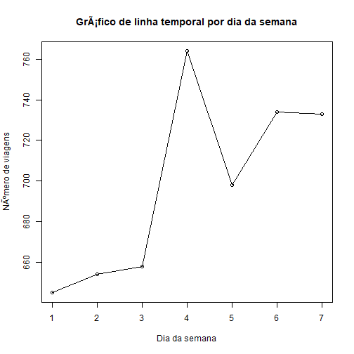

# Trabalho final de R do grupo

### Participantes: Adriana, Bruno, Rafael e Vinicius

## Carregando as Packages necessarias


```r
library(magrittr)         # quando der problema com o "%>%"
library(dplyr)            # selecao e filtro de dados
library(geosphere)        # localizacao geoespacial
library(lubridate)        # datas, funcoes hour, month, wday
library(plotly)           # plot dos graficos
library(knitr)            # usada pelo plotly
library(dummies)          # cria colunas binarias para variaveis categoricas
library(scales)           # normaliza dados rescalando para float de 0 a 1
library(randomForest)     # cria rede neural para criar regressao de tempo de viagem
library(tidyverse)
library(yaml)
library(knitr)
source('preprocessing.R')
source('mapa_calor_ny.R')
```


## Carregando o Dataset (compactado)


```r
read.csv(gzfile("./data_source/train.csv.gz")) %>% 
  as.data.frame() -> train
```


## Ver os primeiros 3 registros


```r
head(train, 3)
```


## Verificar se existem nulos


```r
sum(is.na(train))
```

```
## [1] 0
```


## Summary do Dataset


```r
summary(train)
```

```
##          id            vendor_id                pickup_datetime   
##  id0000001:      1   Min.   :1.000   2016-01-12 18:48:44:      5  
##  id0000003:      1   1st Qu.:1.000   2016-02-09 21:03:38:      5  
##  id0000005:      1   Median :2.000   2016-03-04 08:07:34:      5  
##  id0000008:      1   Mean   :1.535   2016-04-05 18:55:21:      5  
##  id0000009:      1   3rd Qu.:2.000   2016-05-07 13:18:07:      5  
##  id0000011:      1   Max.   :2.000   2016-06-10 23:17:17:      5  
##  (Other)  :1458638                   (Other)            :1458614  
##             dropoff_datetime   passenger_count pickup_longitude 
##  2016-02-19 19:25:04:      5   Min.   :0.000   Min.   :-121.93  
##  2016-05-16 19:40:28:      5   1st Qu.:1.000   1st Qu.: -73.99  
##  2016-01-07 08:04:32:      4   Median :1.000   Median : -73.98  
##  2016-01-08 12:43:38:      4   Mean   :1.665   Mean   : -73.97  
##  2016-01-08 13:00:41:      4   3rd Qu.:2.000   3rd Qu.: -73.97  
##  2016-01-09 15:59:42:      4   Max.   :9.000   Max.   : -61.34  
##  (Other)            :1458618                                    
##  pickup_latitude dropoff_longitude dropoff_latitude store_and_fwd_flag
##  Min.   :34.36   Min.   :-121.93   Min.   :32.18    N:1450599         
##  1st Qu.:40.74   1st Qu.: -73.99   1st Qu.:40.74    Y:   8045         
##  Median :40.75   Median : -73.98   Median :40.75                      
##  Mean   :40.75   Mean   : -73.97   Mean   :40.75                      
##  3rd Qu.:40.77   3rd Qu.: -73.96   3rd Qu.:40.77                      
##  Max.   :51.88   Max.   : -61.34   Max.   :43.92                      
##                                                                       
##  trip_duration    
##  Min.   :      1  
##  1st Qu.:    397  
##  Median :    662  
##  Mean   :    959  
##  3rd Qu.:   1075  
##  Max.   :3526282  
## 
```


## Selecionando 10.000 registros aleatorios para analise -> jogando em um novo dataset que será utilizado daqui em diante

### motivo: utilizar o dataset completo trava o RStudio em nossos equipamentos


```r
set.seed(20)
# Criando uma sequencia de 1 ate a quantidade de total de linhas
linhas.idx <- seq_len(nrow(train))
# Obtendo aleatoriamente 10000 amostras de linhas do dataset
linhas.sample <- sample(linhas.idx, 5000)
# Amostra aleatoria com 10000 dados
df <- train[linhas.sample, ]
head(df, 10)
```


# Preparacao dos dados

## Regiao de saida


```r
df$bairro_saida = mapply(define_bairro, df$pickup_longitude, df$pickup_latitude)
df$bairro_chegada = mapply(define_bairro, df$dropoff_longitude, df$dropoff_latitude)
```


## Adiciona distancia Euclidiana calculada a partir das coordenadas (arquivo Preprocessing.R)


```r
#Distancia em KM
df$dist_euclidiana = dist_eucl(df)
```


## Adiciona distancia de Manhattan calculada a partir das coordenadas (arquivo Preprocessing.R)


```r
df$dist_manhattan = dist_manh(df)
df$velocidade = df$dist_manhattan / df$trip_duration
```


## Prepara data e hora da partida
## Com isso e possivel pegar horario de pico e dia da semana


```r
df$pickup_hour <- hour(df$pickup_datetime)
df$pickup_month <- month(df$pickup_datetime)
df$pickup_weekdays <- wday(df$pickup_datetime)
```


## Transforma as variaveis de tempo em senoides


```r
df$sen_hour <- sin(df$pickup_hour / 3.4)
df$sen_month <- sin(df$pickup_month / 1.7)
df$sen_week <- sin(df$pickup_weekdays)
```


## Exemplo conversao do periodo de 24h em senoide


```r
plot( sin(seq(from = 1, to = 24/3.4, length.out = 70 )), type = 'o' )
```


## Limpeza de corridas zeradas e limpa corridas muito longas


```r
df %>%
  filter(df$dist_manhattan > 0.5) -> df
df %>%
  filter(df$trip_duration < 10000) -> df
```


# Analises descritivas

## Divisao das regioes que separamos em NY:


## Quantidade de viagens por regiao de saida e chegada


```r
df %>%
  group_by(bairro_saida) %>%
  count() -> data_plot
plot1 = plot_ly(data= data_plot, x= ~bairro_saida, y= ~n, type = 'bar')

df %>%
  group_by(bairro_chegada) %>%
  count() -> data_plot
plot2 = plot_ly(data= data_plot, x= ~bairro_chegada, y= ~n, type = 'bar')

subplot(plot1, plot2, shareY = T)
```

```
## Error in loadNamespace(name): there is no package called 'webshot'
```


## Media da velocidade das viagens por regiao de saida e chegada


```r
df %>%
  group_by(bairro_saida) %>%
  summarize(velocidade_media = mean(velocidade),n()) -> data_plot
plot1 = plot_ly(data= data_plot, x= ~bairro_saida, y= ~velocidade_media, type = 'bar')

df %>%
  group_by(bairro_chegada) %>%
  summarize(velocidade_media = mean(velocidade),n()) -> data_plot
plot2 = plot_ly(data= data_plot, x= ~bairro_chegada, y= ~velocidade_media, type = 'bar')

subplot(plot1, plot2, shareY = T)
```

```
## Error in loadNamespace(name): there is no package called 'webshot'
```


## Plotar correlacao passageiros tempo


```r
p1 = plot_ly(data= df, x= ~passenger_count, y= ~trip_duration, type = 'scatter', mode = 'markers') 
p2 = plot_ly(data= df, x= ~dist_manhattan, y= ~trip_duration, type = 'scatter', mode = 'markers') %>% 
  layout(title="Correlacao Num. Passageiros vs. Tempo   |   Correlacao Distancia vs. Tempo")
subplot(p1, p2)
```

```
## Error in loadNamespace(name): there is no package called 'webshot'
```


## Media da velocidade das viagens por hora e dia da semana


```r
df %>%
  group_by(pickup_hour) %>%
  summarize(velocidade_media = mean(velocidade),n()) -> data_plot1
plot1 = plot_ly(data= data_plot1, x= ~pickup_hour, y= ~velocidade_media, type = 'scatter', mode='lines')
df %>%
  group_by(pickup_weekdays) %>%
  summarize(velocidade_media = mean(velocidade),n()) -> data_plot2
plot2 = plot_ly(data= data_plot2, x= ~pickup_weekdays, y= ~velocidade_media, type = 'scatter', mode='lines') %>% 
  layout(title="Horas       |        Dias da Semana") 

subplot(plot1, plot2, shareY = T)
```

```
## Error in loadNamespace(name): there is no package called 'webshot'
```


## Quantidade de viagens por hora e dia da semana


```r
df %>%
  group_by(pickup_hour) %>%
  count() -> data_plot1
plot1 = plot_ly(data= data_plot1, x= ~pickup_hour, y= ~n, type = 'bar')
df %>%
  group_by(pickup_weekdays) %>%
  count() -> data_plot2
plot2 = plot_ly(data= data_plot2, x= ~pickup_weekdays, y= ~n, type = 'bar') %>% 
  layout(title="Horas       |        Dias da Semana") 

subplot(plot1, plot2)
```

```
## Error in loadNamespace(name): there is no package called 'webshot'
```


## Plota mapa de calor de New York com ponto de partida da viagem


```r
heat_map_taxi(train, "pickup")
```

```
## OGR data source with driver: ESRI Shapefile 
## Source: "D:\GITHUB\analise_taxi\data_source\mapa_ny", layer: "geo_export_8661594b-4f67-485f-8af1-84a4bd06054d"
## with 5 features
## It has 4 fields
```

```
## Error in loadNamespace(name): there is no package called 'webshot'
```


## Plota mapa de calor de New York com ponto de chegada da viagem


```r
heat_map_taxi(train, "dropoff")
```

```
## OGR data source with driver: ESRI Shapefile 
## Source: "D:\GITHUB\analise_taxi\data_source\mapa_ny", layer: "geo_export_8661594b-4f67-485f-8af1-84a4bd06054d"
## with 5 features
## It has 4 fields
```

```
## Error in loadNamespace(name): there is no package called 'webshot'
```


## Executar uma analise de clusters (duracao da viagem) atraves do "kmeans"


```r
kmeans_data <- df[, c("trip_duration", "dist_euclidiana")]
boxplot(kmeans_data[, c("trip_duration")], las=1, xlab="trip_duration")
```


```r
boxplot(kmeans_data[, c("dist_euclidiana")], las=1, xlab=c("dist_euclidiana"))
```


```r
normalized <-(kmeans_data-min(kmeans_data))/(max(kmeans_data)-min(kmeans_data))
clusters <- kmeans(normalized, centers = 3)
plot(normalized, col=clusters$cluster, pch=21, cex=1)
```


## Calculando os intervalos de 15 em 15 minutos na coluna hour_quarter, 


```r
df %>%
  mutate(pickup_time_in_minutes = minute(pickup_datetime) + hour(pickup_datetime) * 60) %>% 
  mutate(hour_quarter = pickup_time_in_minutes %/% 15) -> df
head(df, 3)
```


```r
df %>%
  group_by(hour_quarter) %>% 
  summarise(count = n()) -> hour_quarter_freq
plot(hour_quarter_freq, type = "o", main="Grafico de linha temporal por quartos de hora", xlab="Quarto de hora", ylab="Numero de viagens")
```


```r
df %>%
  group_by(pickup_month) %>% 
  summarise(count = n()) -> month_freq
plot(month_freq, type = "o", main="Grafico de linha temporal mensal", xlab="Mês", ylab="Número de viagens")
```


```r
df %>%
  group_by(pickup_weekdays) %>% 
  summarise(count = n()) -> weekday_freq
plot(weekday_freq, type = "o", main="Gráfico de linha temporal por dia da semana", xlab="Dia da semana", ylab="Número de viagens")
```




# Normalizar dados para o modelo

## Primeiro, criando variaveis dummies para dia da semana e hora


```r
bairro_dummy = dummy(df$bairro_chegada, sep='_')
df = data.frame(cbind(df, bairro_dummy))
```


## Agora normalizando com Min Max Scaler as variaveis: distancia, trip_duration e passenger_count


```r
df$dist_manhattan = rescale(df$dist_manhattan)
df$trip_duration = rescale(df$trip_duration)
df$passenger_count = rescale(df$trip_duration)
```


## PODE REMOVER - Verificar se tem as colunas


```r
head(train, 3)
```


## define X (train features) e y (target) para o treino


```r
X <- df[c('passenger_count'
          , 'dist_manhattan'
          , 'sen_hour'
          , 'sen_week'
          , 'sen_month'
          , 'bairro_chegada_1'
          , 'bairro_chegada_2'
          , 'bairro_chegada_3'
          , 'bairro_chegada_4'
          , 'bairro_chegada_5'
          , 'bairro_chegada_6'
          , 'bairro_chegada_7'
          , 'bairro_chegada_8'
          , 'bairro_chegada_9')]
```

```
## Error in `[.data.frame`(df, c("passenger_count", "dist_manhattan", "sen_hour", : undefined columns selected
```

```r
y <- df['trip_duration']
```


## Cria modelo random forest para previsao de tempo de duracaoo das viagens (trip_duration)


```r
f = create_formula(X)
fit <- randomForest(f, df, importance=TRUE, ntree=200)
```

```
## Error in eval(predvars, data, env): object 'bairro_chegada_1' not found
```

```r
varImpPlot(fit)
```


```r
print(fit)
```

```
## 
## Call:
##  randomForest(formula = f, data = df, importance = TRUE, ntree = 200) 
##                Type of random forest: regression
##                      Number of trees: 200
## No. of variables tried at each split: 4
## 
##           Mean of squared residuals: 0.0003007717
##                     % Var explained: 97.37
```


# Criar o html


```r
knit('trabalho_entrega.Rmd')
```

```
## 
## 
## processing file: trabalho_entrega.Rmd
```

```
## 
  |                                                                       
  |                                                                 |   0%
  |                                                                       
  |.                                                                |   2%
##   ordinary text without R code
## 
## 
  |                                                                       
  |..                                                               |   3%
## label: unnamed-chunk-65 (with options) 
## List of 2
##  $ message: logi FALSE
##  $ warning: logi FALSE
## 
## 
  |                                                                       
  |...                                                              |   5%
##   ordinary text without R code
## 
## 
  |                                                                       
  |....                                                             |   6%
## label: unnamed-chunk-66
## 
  |                                                                       
  |.....                                                            |   8%
##   ordinary text without R code
## 
## 
  |                                                                       
  |......                                                           |   9%
## label: unnamed-chunk-67
## 
  |                                                                       
  |.......                                                          |  11%
##   ordinary text without R code
## 
## 
  |                                                                       
  |........                                                         |  12%
## label: unnamed-chunk-68
## 
  |                                                                       
  |.........                                                        |  14%
##   ordinary text without R code
## 
## 
  |                                                                       
  |..........                                                       |  15%
## label: unnamed-chunk-69
## 
  |                                                                       
  |...........                                                      |  17%
##   ordinary text without R code
## 
## 
  |                                                                       
  |............                                                     |  18%
## label: unnamed-chunk-70
## 
  |                                                                       
  |.............                                                    |  20%
##   ordinary text without R code
## 
## 
  |                                                                       
  |..............                                                   |  22%
## label: unnamed-chunk-71
## 
  |                                                                       
  |...............                                                  |  23%
##   ordinary text without R code
## 
## 
  |                                                                       
  |................                                                 |  25%
## label: unnamed-chunk-72
## 
  |                                                                       
  |.................                                                |  26%
##   ordinary text without R code
## 
## 
  |                                                                       
  |..................                                               |  28%
## label: unnamed-chunk-73
## 
  |                                                                       
  |...................                                              |  29%
##   ordinary text without R code
## 
## 
  |                                                                       
  |....................                                             |  31%
## label: unnamed-chunk-74
## 
  |                                                                       
  |.....................                                            |  32%
##   ordinary text without R code
## 
## 
  |                                                                       
  |......................                                           |  34%
## label: unnamed-chunk-75
## 
  |                                                                       
  |.......................                                          |  35%
##   ordinary text without R code
## 
## 
  |                                                                       
  |........................                                         |  37%
## label: unnamed-chunk-76
```

```
## 
  |                                                                       
  |.........................                                        |  38%
##   ordinary text without R code
## 
## 
  |                                                                       
  |..........................                                       |  40%
## label: unnamed-chunk-77
## 
  |                                                                       
  |...........................                                      |  42%
##   ordinary text without R code
## 
## 
  |                                                                       
  |............................                                     |  43%
## label: unnamed-chunk-78
## 
  |                                                                       
  |.............................                                    |  45%
##   ordinary text without R code
## 
## 
  |                                                                       
  |..............................                                   |  46%
## label: unnamed-chunk-79
## 
  |                                                                       
  |...............................                                  |  48%
##   ordinary text without R code
## 
## 
  |                                                                       
  |................................                                 |  49%
## label: unnamed-chunk-80
## 
  |                                                                       
  |.................................                                |  51%
##   ordinary text without R code
## 
## 
  |                                                                       
  |..................................                               |  52%
## label: unnamed-chunk-81
## 
  |                                                                       
  |...................................                              |  54%
##   ordinary text without R code
## 
## 
  |                                                                       
  |....................................                             |  55%
## label: unnamed-chunk-82
## 
  |                                                                       
  |.....................................                            |  57%
##   ordinary text without R code
## 
## 
  |                                                                       
  |......................................                           |  58%
## label: unnamed-chunk-83 (with options) 
## List of 2
##  $ message: logi FALSE
##  $ warning: logi FALSE
```

```
## Warning in `proj4string<-`(`*tmp*`, value = CRS("+proj=longlat +datum=WGS84 +no_defs +ellps=WGS84 +towgs84=0,0,0")): A new CRS was assigned to an object with an existing CRS:
## +proj=longlat +ellps=WGS84 +no_defs
## without reprojecting.
## For reprojection, use function spTransform
```

```
## 
  |                                                                       
  |.......................................                          |  60%
##   ordinary text without R code
## 
## 
  |                                                                       
  |........................................                         |  62%
## label: unnamed-chunk-84 (with options) 
## List of 2
##  $ message: logi FALSE
##  $ warning: logi FALSE
```

```
## Warning in `proj4string<-`(`*tmp*`, value = CRS("+proj=longlat +datum=WGS84 +no_defs +ellps=WGS84 +towgs84=0,0,0")): A new CRS was assigned to an object with an existing CRS:
## +proj=longlat +ellps=WGS84 +no_defs
## without reprojecting.
## For reprojection, use function spTransform
```

```
## 
  |                                                                       
  |.........................................                        |  63%
##   ordinary text without R code
## 
## 
  |                                                                       
  |..........................................                       |  65%
## label: unnamed-chunk-85
```

```
## 
  |                                                                       
  |...........................................                      |  66%
##   ordinary text without R code
## 
## 
  |                                                                       
  |............................................                     |  68%
## label: unnamed-chunk-86
```

```
## 
  |                                                                       
  |.............................................                    |  69%
##   ordinary text without R code
## 
## 
  |                                                                       
  |..............................................                   |  71%
## label: unnamed-chunk-87
## 
  |                                                                       
  |...............................................                  |  72%
##   ordinary text without R code
## 
## 
  |                                                                       
  |................................................                 |  74%
## label: unnamed-chunk-88
```

```
## 
  |                                                                       
  |.................................................                |  75%
##   ordinary text without R code
## 
## 
  |                                                                       
  |..................................................               |  77%
## label: unnamed-chunk-89
```

```
## 
  |                                                                       
  |...................................................              |  78%
##   ordinary text without R code
## 
## 
  |                                                                       
  |....................................................             |  80%
## label: unnamed-chunk-90
```

```
## 
  |                                                                       
  |.....................................................            |  82%
##   ordinary text without R code
## 
## 
  |                                                                       
  |......................................................           |  83%
## label: unnamed-chunk-91
## 
  |                                                                       
  |.......................................................          |  85%
##   ordinary text without R code
## 
## 
  |                                                                       
  |........................................................         |  86%
## label: unnamed-chunk-92
## 
  |                                                                       
  |.........................................................        |  88%
##   ordinary text without R code
## 
## 
  |                                                                       
  |..........................................................       |  89%
## label: unnamed-chunk-93
## 
  |                                                                       
  |...........................................................      |  91%
##   ordinary text without R code
## 
## 
  |                                                                       
  |............................................................     |  92%
## label: unnamed-chunk-94
## 
  |                                                                       
  |.............................................................    |  94%
##   ordinary text without R code
## 
## 
  |                                                                       
  |..............................................................   |  95%
## label: unnamed-chunk-95
```

```
## 
  |                                                                       
  |...............................................................  |  97%
##   ordinary text without R code
## 
## 
  |                                                                       
  |................................................................ |  98%
## label: unnamed-chunk-96
```

```
## 
  |                                                                       
  |.................................................................| 100%
##   ordinary text without R code
```

```
## output file: trabalho_entrega.md
```

```
## [1] "trabalho_entrega.md"
```

